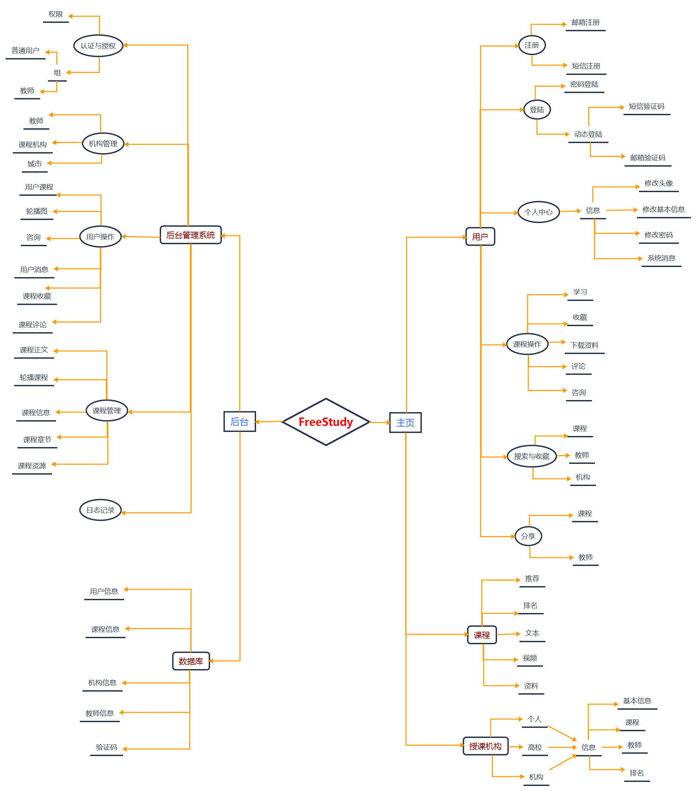
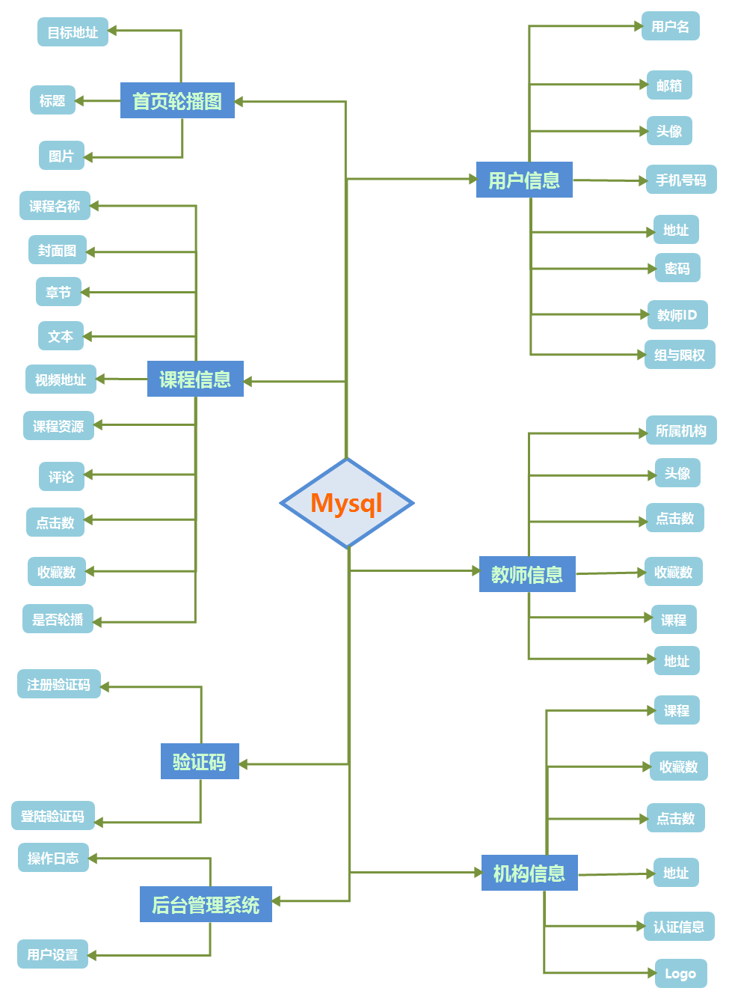
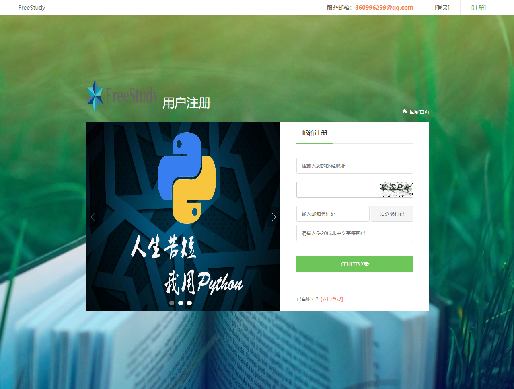
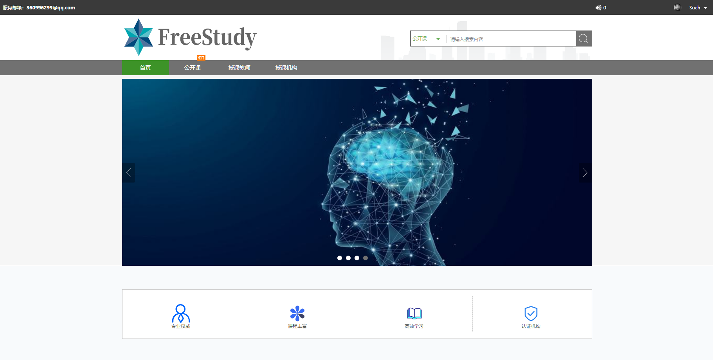
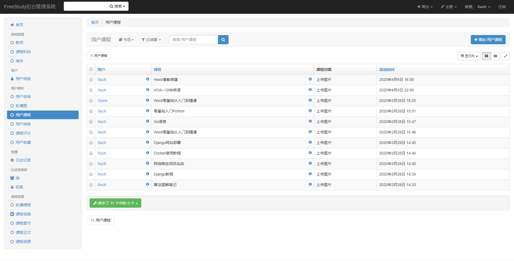
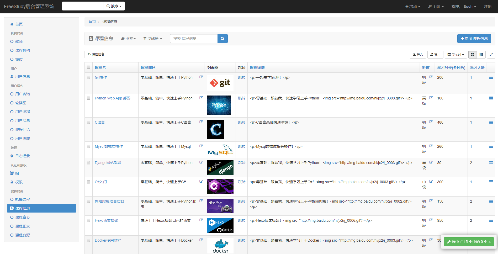

# FreeStudy共享学习平台

`FreeStudy` 是一个基于免费、自由、共享、高效学习理念的网络学习分享平台。涵盖高校、机构、个人等组织，课程覆盖性广，通过文本、视频、文件资料等路径，为用户提供更高效、便捷、多途径的学习方法。

## 特点

- 基于Django2.2框架构建
- Python、HTML、CSS、JS、JQuery等技术应用
- 使用Xadmin高效管理前端数据，实现动态发布
- 登陆与注册等操作：手机短信验证或邮件验证
- Redis存储管理验证码
- 服务器使用Docker+Uwsgi+Nginx+Redis+mariadb实现项目部署
- 数据库可通过本地Navicat连接服务器Docker容器，实现访问
- 针对不同设备屏幕分辨率显示等问题，优化了不同的显示效果，使页面效果达到最佳显示

## 结构图

### 功能图

### 数据库结构图

## 项目图片

### 前台功能

### 后台管理系统

## 安装

请访问我的博客：[安装教程](https://govin.top/2020/04/01/Docker-Uwsgi-Nginx%E9%83%A8%E7%BD%B2Django%E9%A1%B9%E7%9B%AE/)